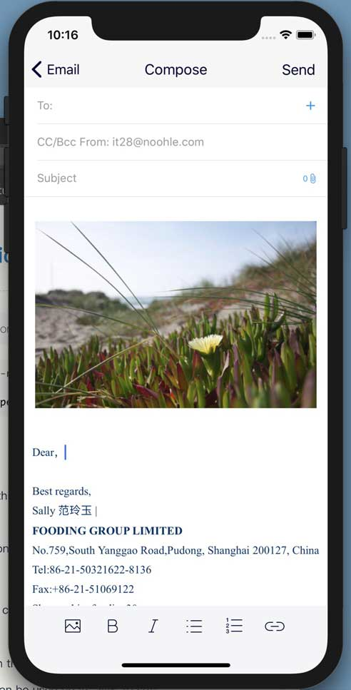

# React Native Rich Text Editor


[](https://www.npmjs.com/package/react-native-pell-rich-editor)

------


> A fully functional Rich Text Editor for both Android and iOS (macOS and windows)?

> If you want to use **flutter**, you can check [here](https://github.com/wxik/flutter-rich-editor) to add **flutter_rich_editor**

```
yarn add react-native-pell-rich-editor
or
npm i react-native-pell-rich-editor
```

Also, follow instructions [here](https://github.com/react-native-community/react-native-webview) to add the native `react-native-webview` dependency.

* [Online Preview](https://wxik.github.io/react-native-rich-editor/web) （Some functions）
* [Example](./examples) Hooks Rewrite



---
## Scroll problem
###`usecontainer = {true}` Need to be placed in ScrolView and add a callback method `oncursorPosition` to handle scroll bar positioning, refer to Examples
```this.scrollRef.current.scrollTo({y: scrollY - 30, animated: true});```

---

## `RichEditor`
The editor component. Simply place this component in your view hierarchy to receive a fully functional Rich text Editor.

`RichEditor` takes the following optional props:

* `placeholder`

    Wrap the editor content placeholder

* `initialContentHTML`

    HTML that will be rendered in the content section on load.

* `initialFocus`
* Boolean value to Initial content request focus. The default value is `false`.

* `disabled`
* Boolean value to disable editor. The default value is `false`.

* `enterKeyHint`
* String value to set return key type - [returnKeyType](https://reactnative.dev/docs/textinput#returnkeytype)

* `editorInitializedCallback `

    A function that will be called when the editor has been initialized.

* `editorStyle`

    Styling for container or for Rich Editor more dark or light settings. Object containing the following options:

    - `backgroundColor`: Editor background color
    - `color`: Editor text color
    - `caretColor` cursor/selection color
    - `placeholderColor`: Editor placeholder text color
    - `contentCSSText`: editor content css text（initial valid）
    - `cssText`: editor global css text（initial valid）
    - `initialCSSText`: injects CSS at the beginning of the inline stylesheet. Useful for incorporating custom fonts (see below).

* `onChange`
    Callback after editor data modification

* `onHeightChange`
    Callback after height change

* `onMessage`
    Callback outside postMessage internal type processing
    ```html
    
    ```

* `command`
  Execute JS in the editor
   ```js
    // $ = document
    this.richText.current?.commandDOM('$.execCommand('insertHTML', false, "<br/>")');
    ```

* `commandDOM`
  Manipulate the DOM in the editor
   ```js
    // $ = document.querySelector
    this.richText.current?.commandDOM(`$('#title').style.color='${color}'`);
    ```

* `useContainer`
    A boolean value that determines if a View container is wrapped around the WebView. The default value is true. If you are using your own View to wrap this library around, set this value to false.

* `styleWithCSS`
    When true, style attribute of tags are modified. Otherwise dedicated tags are created. The default value is false 

* `initialHeight`
    useContainer is false by inline view of initial height

* `pasteAsPlainText`
    A boolean value (false as default) that determines if the clipboard paste will keep its format or it will be done as plain text

* `onPaste`
  Callback clipboard paste value

* `onKeyUp`
  Callback Keyup event (Android 229 bug)

* `onKeyDown`
  Callback Keydown event (Android 229 bug)

* `onInput`
  Callback input value

* `onLink`
  Callback link click

* `onFocus`
  Callback editor focus

* `onBlur`
  Callback editor blur

* `onCursorPosition`
  Callback Enter the position of the cursor
  ```this.scrollRef.current.scrollTo({y: scrollY - 30, duration: 100, animated: true});```

`RichEditor` also has methods that can be used on its `ref` to  set:

*  `setContentHTML(html: string)`
*  `insertImage(url: string, style?: string) `
*  `insertLink(title: string, url: string) `
*  `insertText(text: string)`
*  `insertHTML(html: string)`
*  `insertVideo(url: string, style?: string)`
*  `setContentFocusHandler(handler: Function)`
*  `blurContentEditor()`
*  `focusContentEditor()`

This method registers a function that will get called whenver the cursor position changes or a change is made to the styling of the editor at the cursor's position., The callback will be called with an array of `actions` that are active at the cusor position, allowing a toolbar to respond to changes.

*  `registerToolbar(listener: Function)`


### Example Usage:

```javascript
<RichEditor
  ref={(r) => this.richtext = r}
  initialContentHTML={'Hello <b>World</b> <p>this is a new paragraph</p> <p>this is another new paragraph</p>'}
  editorInitializedCallback={() => this.onEditorInitialized()}
/>
```


### Using Custom Fonts
In order to use custom fonts, you need to use `initialCSSText` from the `editorStyle` prop.

1. Upload your font files to https://transfonter.org and check the 'base64' option. When you download the zip file, there will be a stylesheet.css file there.
2. Take your stylesheet.css file and create a `stylesheet.js` file.
3. Create an export and paste the contents of the css file there. e.g.:
```javascript
const FontFamilyStylesheet = `
@font-face {
    font-family: 'Your Font Family';
    src: url('data:font/ttf;charset=utf-8;base64,...............'); // You can also use a web url here
    font-weight: normal;
}
`;

export default FontFamilyStylesheet;
```
4. Where you've incorporated your `RichEditor` component, import the file and utilize it.
```javascript
import FontFamilyStylesheet from 'stylesheet.js';

const fontFamily = 'Your_Font_Family';
const initialCSSText = { initialCSSText: `${FontFamilyStylesheet}`, contentCSSText: `font-family: ${fontFamily}` }
<RichEditor editorStyle={initialCSSText}/>
```
5. Reload the app. You should now be seeing your Rich Editor content in your custom font face!


For more info on how `initialCSSText` works, check out the PR [here](https://github.com/wxik/react-native-rich-editor/pull/111).
Also, credit to [this](https://github.com/wxik/react-native-rich-editor/issues/70#issuecomment-759441101) issue comment and [his fork](https://github.com/FloMueh/react-native-rich-editor) that describes how to use the base64 encoded font file.


## `RichToolbar`

This is a Component that provides a toolbar for easily controlling an editor. It is designed to be used together with a `RichEditor` component.

The `RichToolbar` has one required property:

* `getEditor()`

Which must provide a **function** that returns a `ref` to a `RichEditor` component.

This is because the `ref` is not created until after the first render, before which the toolbar is rendered. This means that any `ref` passed directly will inevitably be passed as `undefined`.

Other props supported by the `RichToolbar` component are:

* `actions`

	An `array` of `actions` to be provided by this toolbar. The default actions are:
	* `actions.insertImage`
    * `actions.setBold`
    * `actions.setItalic`
    * `actions.insertBulletsList`
    * `actions.insertOrderedList`
    * `actions.insertLink`
    * `actions.keyboard`
    * `actions.setStrikethrough`
    * `actions.setUnderline`
    * `actions.removeFormat`
    * `actions.insertVideo`
    * `actions.checkboxList`
    * `actions.undo`
    * `actions.redo`


* `onPressAddImage`
    Functions called when the `addImage` actions are tapped.

* `onInsertLink`
    Logic for what happens when you press on the add insert link button

* `disabled`
* Boolean value to disable editor. The default value is `false`.


* `iconTint`
* `unselectedButtonStyle`
* `selectedIconTint`
* `selectedButtonStyle`
* `disabledIconTint`
* `disabledButtonStyle`

    These provide options for styling action buttons.

* `iconSize`

    Defines the size of the icon in pixels. Default is 50.

* `renderAction`

	Altenatively, you can provide a render function that will be used instead of the default, so you can fully control the tollbar design.


* `iconMap`

	`RichTextToolbar` comes with default icons for the default actions it renders. To override those, or to add icons for non-default actions, provide them in a dictionary to this prop.


### Example Usage:

```javascript
const richText = React.createRef() || useRef();
<RichToolbar editor={that.richText}/>
```

#### With Custom Action:

To define your own custom action:

-   Send your action name as string in the `actions` array.
-   Include an icon for it with the `iconMap`
-   Add a function prop with the same action name to be called on tap

```javascript
<RichToolbar
    editor={that.richText}
	actions={[
		actions.setBold,
		actions.setItalic,
		actions.insertBulletsList,
		actions.insertOrderedList,
		actions.insertImage,
		'customAction',
	]}
	iconMap={{
		customAction: customIcon,
	}}
	customAction={this.handleCustomAction}
/>
```

#### A Complete Example Using a Functional Component
```javascript
import React from "react";
import { Text, Platform, KeyboardAvoidingView, SafeAreaView, ScrollView } from "react-native";
import {actions, RichEditor, RichToolbar} from "react-native-pell-rich-editor";


const handleHead = ({tintColor}) => <Text style={{color: tintColor}}>H1</Text>
const TempScreen = () => {
	const richText = React.useRef();
	return (
    <SafeAreaView>
      <ScrollView>
        <KeyboardAvoidingView behavior={Platform.OS === "ios" ? "padding" : "height"}	style={{ flex: 1 }}>
          <Text>Description:</Text>
          <RichEditor
              ref={richText}
              onChange={ descriptionText => {
                  console.log("descriptionText:", descriptionText);
              }}
          />
        </KeyboardAvoidingView>
      </ScrollView>

      <RichToolbar
        editor={richText}
        actions={[ actions.setBold, actions.setItalic, actions.setUnderline, actions.heading1 ]}
        iconMap={{ [actions.heading1]: handleHead }}
      />
    </SafeAreaView>
  );
};

export default TempScreen;
```

---
### Thank you very much for the support of [JetBrains](https://jb.gg/OpenSource)


